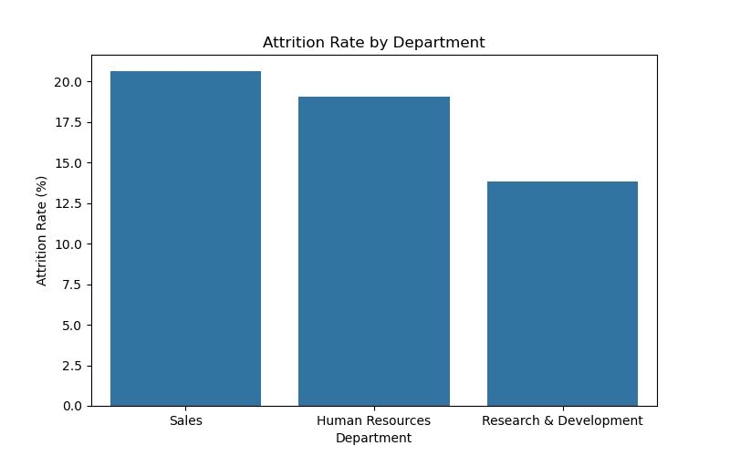
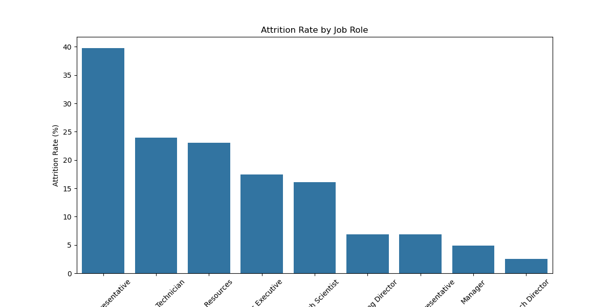
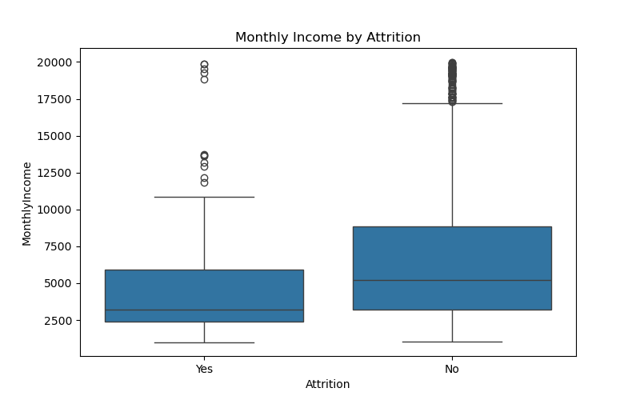
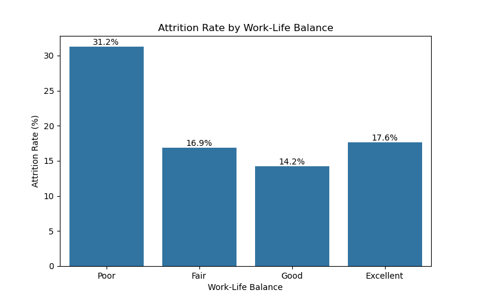
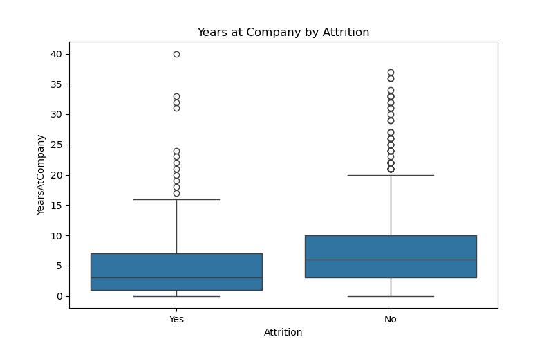
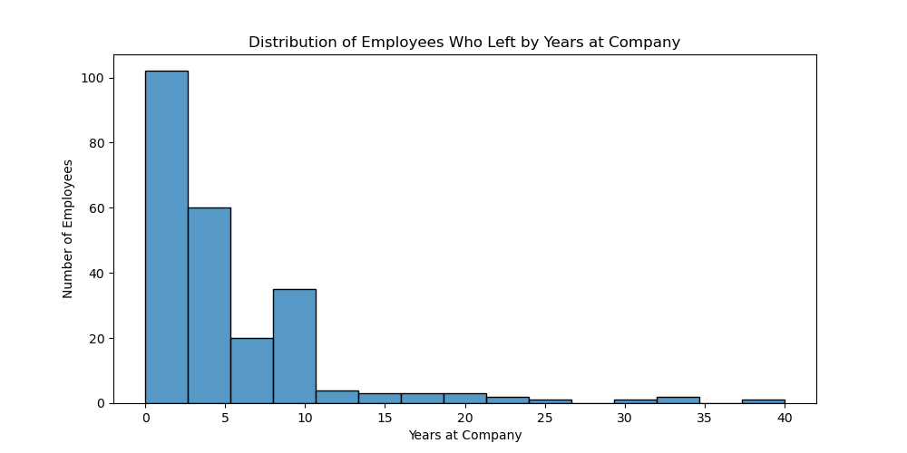
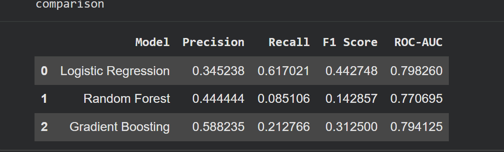
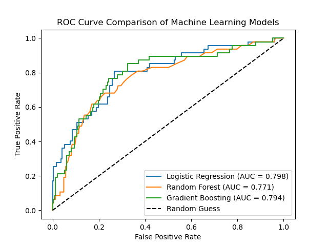
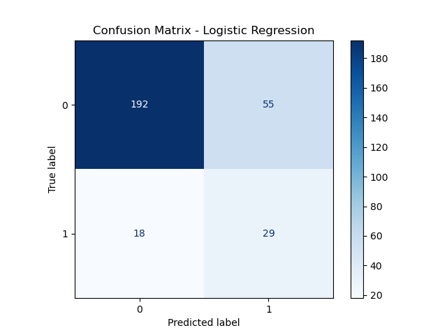
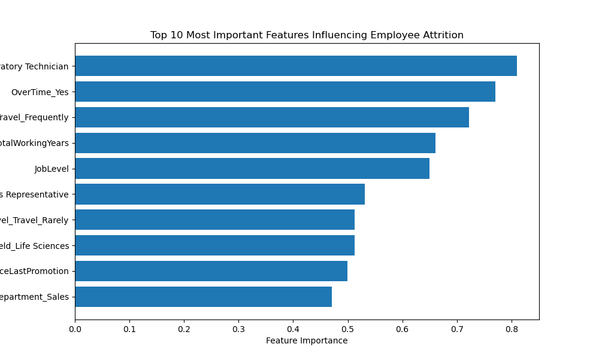

# Employee Attrition Prediction using Machine Learning

> **AI & Data Science Internship – Week 2 Project**

An end-to-end Machine Learning project that predicts employee attrition using the IBM HR Analytics dataset and provides actionable HR insights through data analysis, predictive modeling, and business recommendations.
The project was completed as part of the XYLOFYAI's AI & Data Science Internship – Week 2 Project.

---

# 📖 Project Overview

Employee attrition is a major concern for organizations because losing experienced employees leads to increased recruitment costs, longer onboarding periods, reduced productivity, and knowledge loss.

This project analyzes historical employee data to identify patterns associated with employee turnover and builds a predictive machine learning model capable of identifying employees who are more likely to leave the organization.

Unlike a traditional machine learning project, this work also focuses on translating technical findings into meaningful business recommendations that can help Human Resources (HR) improve employee retention.

---

# 🎯 Problem Statement

The objective of this project is to answer the following business questions:

* Which employees are more likely to leave the organization?
* Which departments and job roles experience the highest attrition?
* Does salary alone explain employee turnover?
* Which workplace factors contribute most to employee attrition?
* How can HR proactively reduce employee turnover?

---

# 📂 Dataset

**Dataset:** IBM HR Analytics Employee Attrition & Performance

**Source:**
https://www.kaggle.com/datasets/pavansubhasht/ibm-hr-analytics-attrition-dataset

### Dataset Statistics

| Property          |     Value |
| ----------------- | --------: |
| Total Employees   |      1470 |
| Original Features |        35 |
| Target Variable   | Attrition |
| Employees Stayed  |      1233 |
| Employees Left    |       237 |
| Attrition Rate    |     16.1% |

Target Variable:

* **Yes** → Employee left the organization
* **No** → Employee stayed with the organization

---

# 🛠 Technologies Used

* Python
* Google Colab
* Pandas
* NumPy
* Matplotlib
* Seaborn
* Scikit-learn

---

# ⚙️ Project Workflow

The project follows a complete Machine Learning pipeline:

1. Data Loading
2. Data Exploration
3. Data Cleaning
4. Data Preprocessing
5. Exploratory Data Analysis (EDA)
6. Feature Engineering
7. Model Building
8. Model Evaluation
9. Feature Importance Analysis
10. HR Insights & Business Recommendations

---

# 🔧 Data Preprocessing

The following preprocessing steps were performed before model training:

* Checked for missing values
* Removed irrelevant features

  * EmployeeNumber
  * EmployeeCount
  * StandardHours
  * Over18
* Converted the target variable (Yes/No → 1/0)
* Applied One-Hot Encoding to categorical variables
* Standardized numerical features using StandardScaler
* Split the dataset into 80% training and 20% testing sets

---

# 📊 Exploratory Data Analysis

The exploratory analysis focused on identifying business patterns behind employee attrition.

The following questions were investigated:

* Which department experiences the highest attrition?
* Which job role is most vulnerable?
* Does salary influence attrition?
* How does work-life balance affect employee turnover?
* At what stage of employment do employees usually resign?

---

## Department-wise Attrition



---

## Job Role-wise Attrition



---

## Monthly Income vs Attrition



---

## Work-Life Balance vs Attrition



---

## Years at Company vs Attrition



---

## Distribution of Employees Who Left



---

# 🤖 Machine Learning Models

Three classification models were trained and evaluated.

* Logistic Regression
* Random Forest Classifier
* Gradient Boosting Classifier

To address class imbalance, **class_weight='balanced'** was applied wherever supported.

---

# 📈 Model Performance

The models were evaluated using:

* Precision
* Recall
* F1-Score
* ROC-AUC Score
* Confusion Matrix



**Selected Model:** Logistic Regression

Logistic Regression achieved the highest Recall, F1-Score, and ROC-AUC, making it the most suitable model for identifying employees who are likely to leave.

---

## ROC Curve Comparison



---

## Confusion Matrix



---

# 📌 Top 10 Important Features

The most influential factors affecting employee attrition identified by the selected model are shown below.



Top contributing factors include:

* Laboratory Technician role
* Overtime
* Frequent Business Travel
* Total Working Years
* Job Level
* Sales Representative role
* Years Since Last Promotion
* Sales Department

---

# 📊 Key Business Insights

* The **Sales department** recorded the highest employee attrition (~20.6%).
* **Sales Representatives** experienced the highest turnover (~39.8%) among all job roles.
* Employees with poor **Work-Life Balance** showed an attrition rate of approximately **31.2%**, nearly twice that of employees reporting better work-life balance.
* Employees who left generally had lower monthly incomes, although salary alone did not explain attrition.
* Most employees resigned during their first few years with the company, indicating that early employment is the most critical period for retention.

---

# 💼 Business Recommendations

Based on the analysis, the following recommendations are proposed:

* Prioritize retention efforts within the Sales department, particularly for Sales Representatives.
* Identify employees who frequently work overtime or travel for business and conduct regular retention conversations.
* Improve work-life balance through flexible work arrangements and workload management.
* Strengthen onboarding, mentoring, and career development programs for employees during their first few years.
* Use predictive analytics alongside HR expertise to proactively identify employees at higher risk of leaving.

---

# 📑 Executive Summary

A non-technical executive summary prepared for HR leadership is available here:

📄 **[Executive Summary](summary_week2.pdf)**

---

# 📁 Repository Structure

```text
EmployeeAttrition_Indrayani/
│
├── analysis.ipynb
├── HR_Attrition.csv
├── README.md
├── summary.pdf
│
└── charts/
    ├── AttritionRateByDept.png
    ├── AttritionRateByJobRole.png
    ├── MonthlyIncomeByAttrition.png
    ├── AttritionRateByWorkLife.png
    ├── AttritionVSYearsAtCompany.png
    ├── DistOfEmployees.png
    ├── ModelComparison.png
    ├── ROC_Curve.png
    ├── ConfusionMatrixLR.png
    └── Top10ImpFeatures.png
```

---

# ▶️ Running the Project

1. Clone the repository or download the ZIP file.
2. Open **analysis.ipynb** in Google Colab or Jupyter Notebook.
3. Run all notebook cells sequentially.
4. The dataset is automatically downloaded from Google Drive using **gdown**, so no manual upload is required.
5. Review the generated visualizations, model evaluation, and HR recommendations.

---

# ⚠️ Limitations

This model is based solely on historical employee information available in the dataset. Personal circumstances, organizational restructuring, economic conditions, management style, and future policy changes are not captured. Therefore, the model should be used as a decision-support tool alongside HR expertise rather than as the sole basis for employee-related decisions.

---

# 🚀 Future Improvements

Potential enhancements for this project include:

- Hyperparameter tuning using GridSearchCV or RandomizedSearchCV.
- Handling class imbalance using SMOTE and comparing results.
- Deploying the model as a web application using Streamlit.
- Performing model explainability using SHAP or LIME.
- Building an interactive HR dashboard using Power BI or Tableau.
- Experimenting with XGBoost, LightGBM, or CatBoost.
- Implementing automated model retraining for new employee data.

---

# 👩‍💻 Author

**Indrayani Mude**

AI & Data Science Internship Project Week 2 – XYLOFY AI
